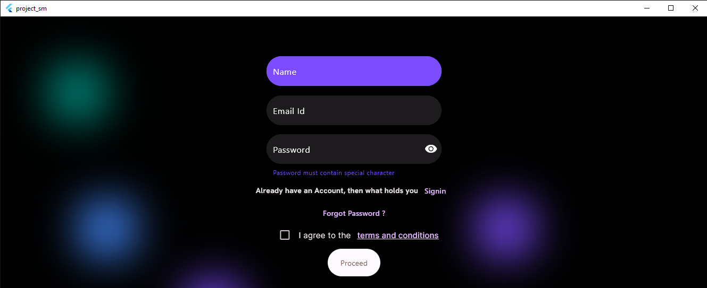
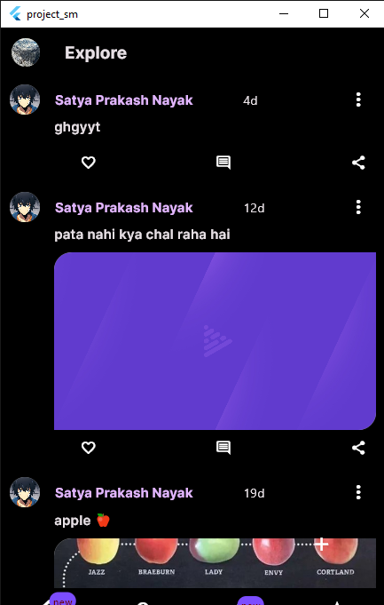
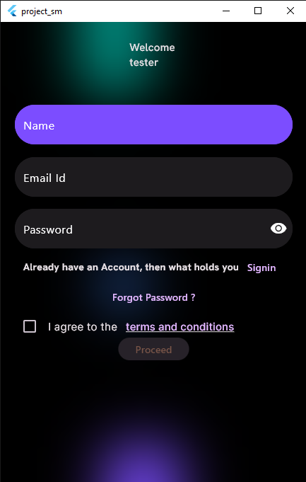

# Project SM - A Microblogging Platform

**Project SM** is a social media app or I say microblogging app built with Flutter 💙. It allows users to share short posts, follow other users, and engage in conversations.

it comes with all the features that you need to use it.

## Features

* **Post Creation:** Easily create and share text-based posts.
* **Following:** Follow other users to see their posts in your feed.
* **Likes and Comments:** Interact with posts by liking and commenting.
* **User Profiles:** View user profiles with their post history.
* **Search:** Find users and posts using keywords.
* **[Add more features as applicable]**

## ScreenShots📱

## Getting Started

**Prerequisites:**

* VS Code or Flutter SDK
* Git
* Appwrite

**Installation:**

1. Clone the repository: `git clone https://github.com/your-username/project-sm.git`
2. Navigate to the project directory: `cd project-sm`
3. update dependencies using `flutter pub get`
4. Run the app:  `flutter run `

## Contributing

Contributions are welcome! If you'd like to contribute to Project SM, please follow these steps:

1. Fork the repository.
2. Create a new branch for your feature or bug fix.
3. Make your changes and commit them.
4. Push your changes to your forked repository.
5. Submit a pull request.

## License

This project is licensed under the [**mention the license, e.g., MIT License**].

## Contact

For any questions or feedback, feel free to reach out to [**your contact information**].
